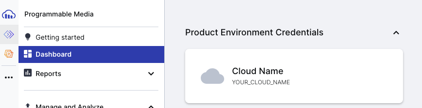

# React Cloundiary

1. Create a free account with Cloudinary
2. Under Dashboard find the Cloud Name
3. Create `REACT_APP_CLOUD_NAME=YOUR_CLOUD_NAME` in your `.env`
4. Under settings (tiny gear in bottom left), select Upload.
5. Enable Unsigned Uploading
6. Create `REACT_APP_PRESET=YOUR_PRESET_NAME` in your `.env`

### Cloud Name

### Preset Name

